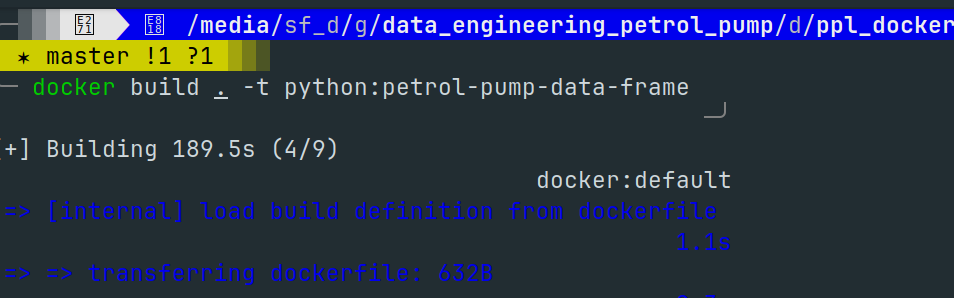
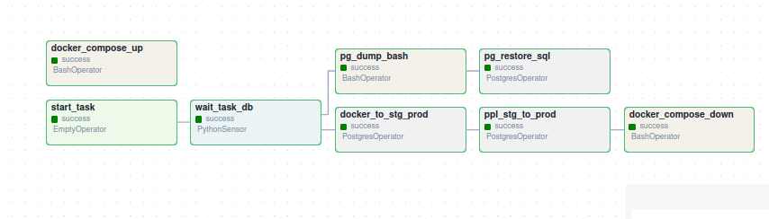
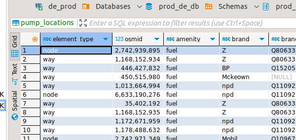
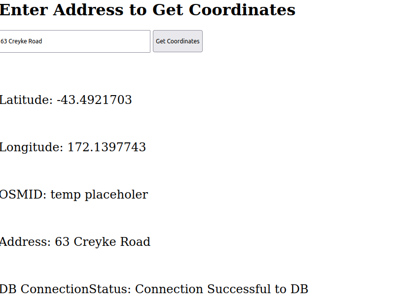
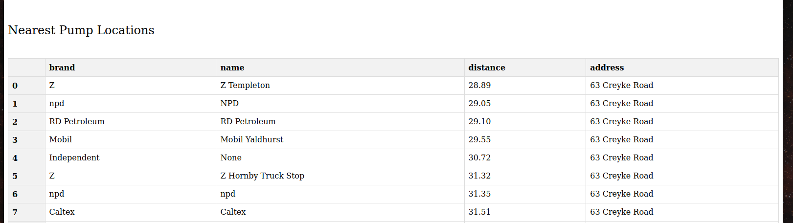

# Project Prerequisites

1) Please note all development has been done on Ubuntu.
2) Please install docker
3) Please install apache-airlfow

Navigate to the directory ppl_dockerfile
The following command needs to be run to build the image 

`docker build . -t python:petrol-pump-data-frame`  

This project can be run in 2 ways 

1) From the terminal
   Step 1) Navigate to the folder docker_scripts 
   Step 2) Run the file docker_run.sh using the below command
              
              `./docker_run.sh`

    This will populate data till staging environment

2) From Apache Airflow 

    1) Activate the conda environment with sirflow 
    2) Trigger the DAG pp_loc_airflow

   
    This will populate all required data in the staging area and the productioon area 

3) You can check the data by logging in to Postgres 

   

4) To run the flask app navigate to the directory  ppl_flask

     Run the command `flask run`

     Here you can enter an address and get nearest petrol pumps   

      

      